# GA1-220501093-04-AA1-EV06 – Python avanzado: Entornos Virtuales, Gestión de Dependencias, Variables de Entorno y Modularización

**Autor:** Jose Manuel Ruiz Zapata
**Ficha:** 3144585

---

## Descripción
Aplicación de consola en Python que permite **registrar**, **listar** y **buscar** usuarios.  
Implementa:
- Entorno virtual (`venv`) para aislar dependencias.
- Variables de entorno mediante `python-dotenv`.
- Modularización en paquetes y módulos.
- Manejo de excepciones para entradas inválidas.

---

## Configuración del entorno virtual

### 1. Crear el entorno virtual
Ejecuta en la raíz del proyecto:
```bash
python -m venv venv
```

## 2. Activar el entorno

### Windows (cmd)
```bash
venv\Scripts\activate.bat
```

### Windows (PowerShell)
```powershell
venv\Scripts\Activate.ps1
```

### Mac/Linux
```bash
source venv/bin/activate
```

Una vez activado, el prompt mostrará:

```bash
(venv)
```

---

## Instalación de dependencias

Con el entorno activado, instala `python-dotenv`:

```bash
pip install python-dotenv
```

Genera el archivo `requirements.txt`:

```bash
pip freeze > requirements.txt
```

---

## Variables de entorno

Crea un archivo `.env` en la raíz con el siguiente contenido:

```ini
APP_NAME=Sistema Usuarios
APP_VERSION=1.0
ADMIN_USER=admin
ADMIN_EMAIL=admin@example.com
```

El módulo `app/config/settings.py` carga estas variables usando `python-dotenv` y las pone a disposición del resto de la aplicación.

---

## Ejecución del sistema

Desde la terminal, con el entorno virtual activado:

```bash
python main.py
```

---

## Funcionalidades

- **Registrar usuario:**  
  Pide nombre y edad. Valida que el nombre no esté vacío y que la edad sea un número entre 0 y 120.

- **Listar usuarios:**  
  Muestra todos los usuarios registrados con ID, nombre y edad.

- **Buscar usuario:**  
  Permite buscar por coincidencia parcial en el nombre.

- **Salir:**  
  Termina el programa.

---

## Manejo de errores

- Si se ingresa un nombre vacío → `ValueError` capturado y mensaje amigable.
- Si la edad no es un número o está fuera de rango → `ValueError`.
- Si la búsqueda está vacía → `ValueError`.

El sistema nunca se cierra inesperadamente, este siempre va a volver al menú.

---

## Estructura modular del proyecto

```text
sistema_usuarios/
│── app/
│   │── __init__.py
│   │── config/
│   │   │── __init__.py
│   │   │── settings.py
│   │── usuarios/
│   │   │── __init__.py
│   │   │── gestor.py
│   │   │── validaciones.py
│── .env
│── main.py
│── requirements.txt     
│── README.md       
```

---

## Responsabilidades de cada módulo

### `settings.py`
Carga las variables del archivo `.env` usando `load_dotenv()` y las expone como constantes.

### `validaciones.py`
Contiene funciones:

- `validar_nombre()`
- `validar_edad()`

Estas lanzan excepciones si los datos no son válidos.

### `gestor.py`
Maneja la lista de usuarios en memoria e implementa:

- `registrar_usuario()`
- `listar_usuarios()`
- `buscar_usuario()`

Utiliza las validaciones.

### `main.py`
- Importa los módulos necesarios.
- Muestra el menú.
- Captura excepciones.
- Muestra mensajes al usuario.

---

## Manejo de excepciones

Las excepciones se utilizan para controlar errores de entrada:

- `ValueError`: cuando los datos no cumplen las reglas de negocio.
- `TypeError`: si el tipo de dato es incorrecto (ej. edad no entera).
- `KeyError`: si se busca un ID inexistente (implementado en `gestor.py`).

En `main.py` se envuelven las llamadas en bloques `try/except` para capturar estas excepciones y mostrar mensajes claros sin detener el programa.

---

## Evidencias

### Creación del entorno virtual
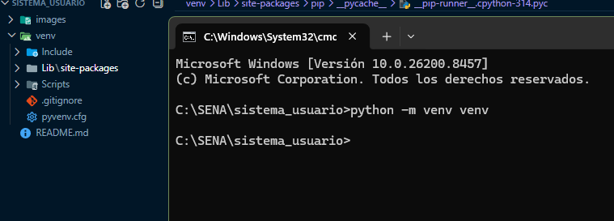

### Activación del entorno
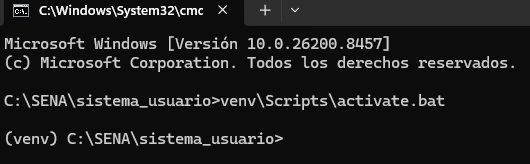

### Instalación de dependencias
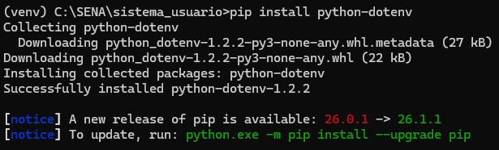

### Generación de requirements.txt
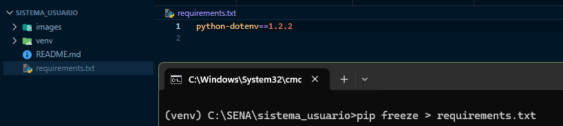

### Registro de usuario exitoso
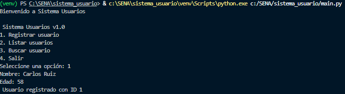

### Listado de usuarios
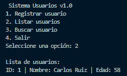

### Búsqueda de usuario
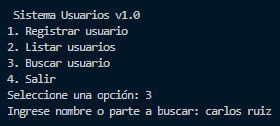

### Manejo de errores
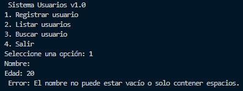

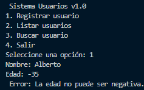

### Archivo .env
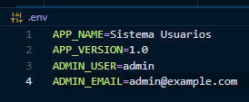

### Archivo settings.py
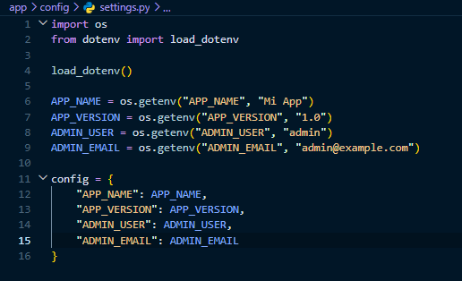

### Variable de entorno usada en ejecución
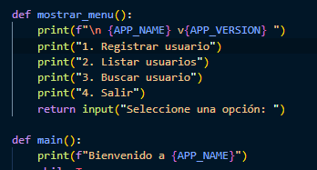

---

## Link del Video en YouTube
https://youtu.be/yK0Qiqn3tHQ
